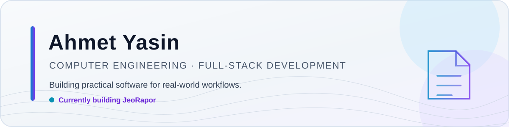
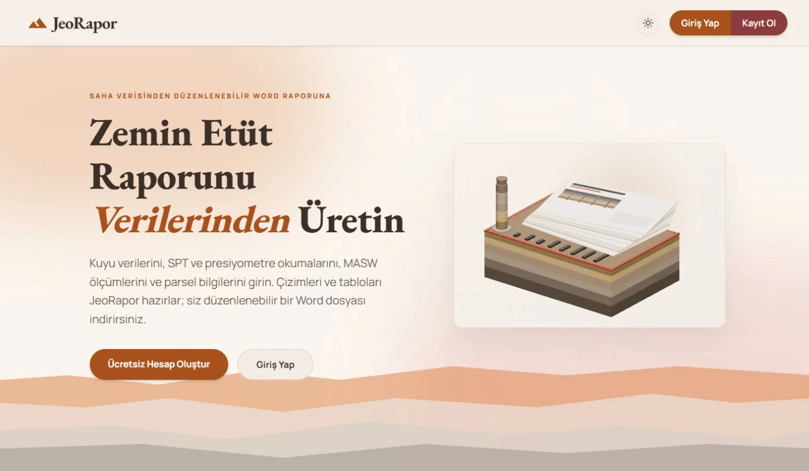
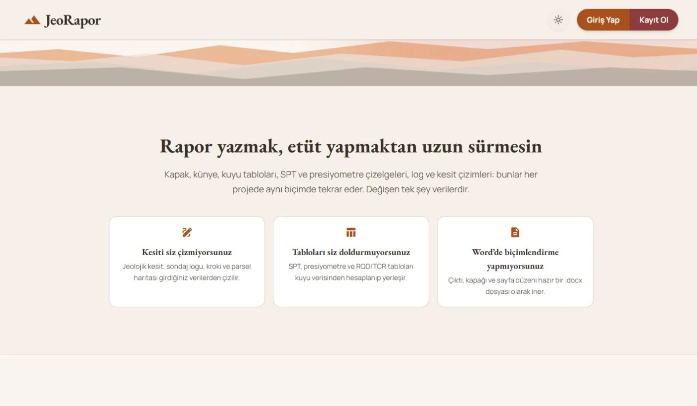
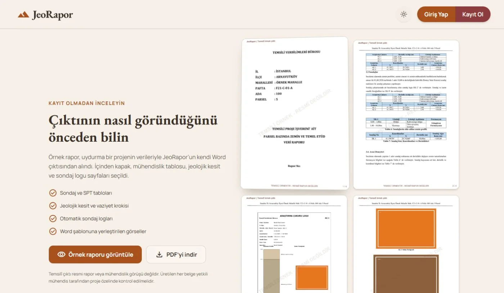

<picture>
  <source media="(prefers-color-scheme: dark)" srcset="assets/header/header-dark.svg">
  <source media="(prefers-color-scheme: light)" srcset="assets/header/header-light.svg">
  
</picture>

<h1 align="center">Ahmet Yasin Geldi</h1>

  Computer Engineering student in Istanbul, Türkiye · Full-stack developer

  <picture>
    <source media="(prefers-color-scheme: dark)" srcset="https://readme-typing-svg.demolab.com?font=JetBrains+Mono&amp;size=18&amp;duration=3000&amp;pause=1000&amp;color=7DD3FC&amp;center=true&amp;vCenter=true&amp;repeat=true&amp;width=760&amp;height=45&amp;lines=Building+software+for+real-world+workflows;Currently+building+JeoRapor;Full-stack+development+%C2%B7+automation+%C2%B7+architecture">
    <source media="(prefers-color-scheme: light)" srcset="https://readme-typing-svg.demolab.com?font=JetBrains+Mono&amp;size=18&amp;duration=3000&amp;pause=1000&amp;color=0369A1&amp;center=true&amp;vCenter=true&amp;repeat=true&amp;width=760&amp;height=45&amp;lines=Building+software+for+real-world+workflows;Currently+building+JeoRapor;Full-stack+development+%C2%B7+automation+%C2%B7+architecture">
    
  </picture>

  
  

## About

I study Computer Engineering and build software that turns repetitive, real-world work into reliable product workflows. My current focus is **JeoRapor**, alongside full-stack architecture, automation, databases, SaaS products, and practical AI-assisted development.

## Featured project — JeoRapor

**JeoRapor** is a long-term, privately developed platform for geological and geotechnical report workflows. It helps engineers move from structured field, borehole, laboratory, seismic, parcel, and project data to validated, editable Word reports.

The technically interesting part is the complete path from a ten-step Next.js editor to secure background jobs and a Python document engine: the application validates report data, generates maps, site sketches, geological sections and borehole logs, then assembles separate data and geotechnical `.docx` outputs.

Currently implemented work includes account and team flows, PostgreSQL-backed report storage, private Cloudflare R2 assets, Excel laboratory imports, report quality checks, asynchronous generation, and responsive editing. Marketplace-style service discovery remains future product work—not a live feature.

  <a href="https://jeorapor.com"><strong>Explore the live product →</strong></a>
   
  Source repository is currently private.

  
  

## Working stack

<table>
  <tr>
    <td><strong>Languages</strong></td>
    <td></td>
  </tr>
  <tr>
    <td><strong>Web</strong></td>
    <td></td>
  </tr>
  <tr>
    <td><strong>Data & infrastructure</strong></td>
    <td></td>
  </tr>
  <tr>
    <td><strong>Tools</strong></td>
    <td></td>
  </tr>
</table>

## What I am exploring

- Product-minded full-stack architecture for focused SaaS tools
- Reliable automation across web, database, storage and document-generation systems
- AI-assisted engineering workflows that keep human review and real data constraints in the loop

## GitHub activity

<picture>
  <source media="(prefers-color-scheme: dark)" srcset="https://raw.githubusercontent.com/AhmetYasinGeldi/AhmetYasinGeldi/output/github-contribution-grid-snake-dark.svg">
  <source media="(prefers-color-scheme: light)" srcset="https://raw.githubusercontent.com/AhmetYasinGeldi/AhmetYasinGeldi/output/github-contribution-grid-snake.svg">
  
</picture>

## Connect

The best place to learn more about my work is [ahmetyasingeldi.dev](https://www.ahmetyasingeldi.dev). I am open to thoughtful conversations about full-stack products, automation, developer tooling, and practical software systems.

Istanbul, Türkiye · Building things that remove repetitive work.

